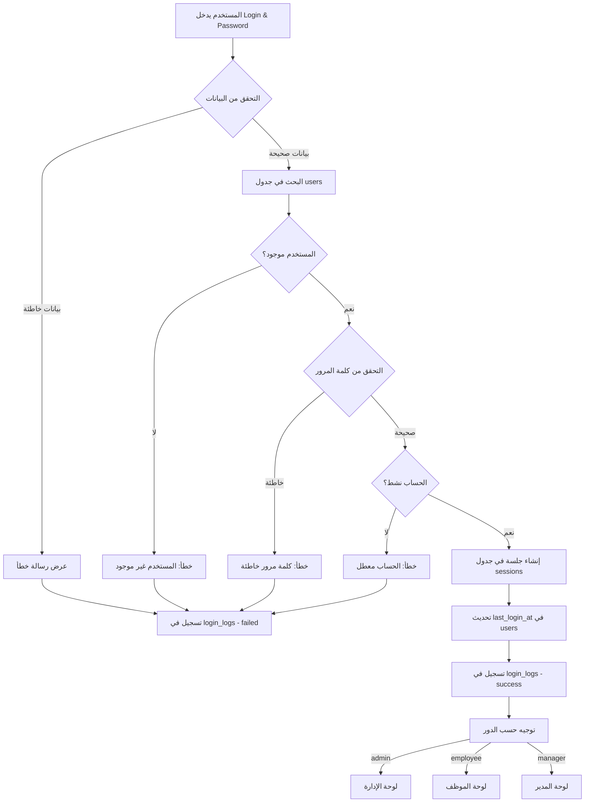
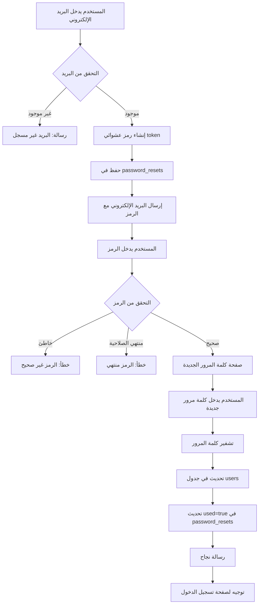

# قاعدة البيانات - نظام تسجيل الدخول وإعادة تعيين كلمة المرور

## 📊 نظرة عامة على البنية

هذا المستند يشرح كيفية إنشاء قاعدة البيانات اللازمة لنظام تسجيل الدخول وإعادة تعيين كلمة المرور.

---

## 🗂️ جداول قاعدة البيانات

### 1. جدول المستخدمين (users)

هذا هو الجدول الرئيسي لتخزين معلومات المستخدمين.

```sql
CREATE TABLE users (
  id INT PRIMARY KEY AUTO_INCREMENT,
  name VARCHAR(100) NOT NULL,
  email VARCHAR(255) UNIQUE NOT NULL,
  login VARCHAR(50) UNIQUE NOT NULL,
  password VARCHAR(255) NOT NULL,
  role ENUM('admin', 'manager', 'employee', 'confirmation_manager', 'delivery', 'packaging', 'livreur') NOT NULL DEFAULT 'employee',
  
  -- معلومات شخصية
  phone VARCHAR(20),
  cin VARCHAR(20),
  cnss VARCHAR(20),
  salary DECIMAL(10, 2),
  bank VARCHAR(100),
  rib VARCHAR(50),
  business VARCHAR(100),
  
  -- الحالة والأمان
  active BOOLEAN DEFAULT TRUE,
  email_verified BOOLEAN DEFAULT FALSE,
  email_verified_at TIMESTAMP NULL,
  
  -- تواريخ
  created_at TIMESTAMP DEFAULT CURRENT_TIMESTAMP,
  updated_at TIMESTAMP DEFAULT CURRENT_TIMESTAMP ON UPDATE CURRENT_TIMESTAMP,
  last_login_at TIMESTAMP NULL,
  
  INDEX idx_login (login),
  INDEX idx_email (email),
  INDEX idx_role (role)
);
```

**الأعمدة المهمة:**
- `id`: معرف فريد لكل مستخدم
- `login`: اسم تسجيل الدخول (مثل: "ahmed.ben")
- `password`: كلمة المرور المشفرة (bcrypt/argon2)
- `role`: دور المستخدم في النظام
- `email`: البريد الإلكتروني (مطلوب لإعادة تعيين كلمة المرور)
- `active`: حالة الحساب (نشط/غير نشط)

---

### 2. جدول إعادة تعيين كلمة المرور (password_resets)

لتخزين رموز إعادة تعيين كلمة المرور المؤقتة.

```sql
CREATE TABLE password_resets (
  id INT PRIMARY KEY AUTO_INCREMENT,
  user_id INT NOT NULL,
  email VARCHAR(255) NOT NULL,
  token VARCHAR(255) NOT NULL,
  
  -- معلومات الطلب
  ip_address VARCHAR(45),
  user_agent TEXT,
  
  -- الحالة والتواريخ
  used BOOLEAN DEFAULT FALSE,
  used_at TIMESTAMP NULL,
  expires_at TIMESTAMP NOT NULL,
  created_at TIMESTAMP DEFAULT CURRENT_TIMESTAMP,
  
  FOREIGN KEY (user_id) REFERENCES users(id) ON DELETE CASCADE,
  INDEX idx_token (token),
  INDEX idx_email (email),
  INDEX idx_expires (expires_at)
);
```

**الأعمدة المهمة:**
- `token`: رمز فريد يُرسل للمستخدم (6 أرقام أو UUID)
- `expires_at`: تاريخ انتهاء صلاحية الرمز (عادةً 15-30 دقيقة)
- `used`: هل تم استخدام الرمز؟
- `ip_address`: عنوان IP للأمان

---

### 3. جدول سجل تسجيل الدخول (login_logs)

لتتبع محاولات تسجيل الدخول الناجحة والفاشلة.

```sql
CREATE TABLE login_logs (
  id INT PRIMARY KEY AUTO_INCREMENT,
  user_id INT NULL,
  login_attempt VARCHAR(50) NOT NULL,
  
  -- نتيجة المحاولة
  success BOOLEAN NOT NULL,
  failure_reason VARCHAR(255),
  
  -- معلومات الجلسة
  ip_address VARCHAR(45),
  user_agent TEXT,
  device_type VARCHAR(50),
  browser VARCHAR(50),
  
  -- التوقيت
  attempted_at TIMESTAMP DEFAULT CURRENT_TIMESTAMP,
  
  FOREIGN KEY (user_id) REFERENCES users(id) ON DELETE SET NULL,
  INDEX idx_user_id (user_id),
  INDEX idx_success (success),
  INDEX idx_attempted_at (attempted_at)
);
```

**الأعمدة المهمة:**
- `success`: هل نجح تسجيل الدخول؟
- `failure_reason`: سبب الفشل (wrong_password, user_not_found, account_disabled)
- `ip_address`: لمنع الهجمات

---

### 4. جدول الجلسات (sessions)

لتخزين جلسات المستخدمين النشطة.

```sql
CREATE TABLE sessions (
  id VARCHAR(255) PRIMARY KEY,
  user_id INT NOT NULL,
  
  -- معلومات الجلسة
  ip_address VARCHAR(45),
  user_agent TEXT,
  device_fingerprint VARCHAR(255),
  
  -- البيانات والحالة
  payload TEXT,
  last_activity TIMESTAMP DEFAULT CURRENT_TIMESTAMP ON UPDATE CURRENT_TIMESTAMP,
  expires_at TIMESTAMP NOT NULL,
  created_at TIMESTAMP DEFAULT CURRENT_TIMESTAMP,
  
  FOREIGN KEY (user_id) REFERENCES users(id) ON DELETE CASCADE,
  INDEX idx_user_id (user_id),
  INDEX idx_last_activity (last_activity)
);
```

**الأعمدة المهمة:**
- `id`: معرف الجلسة (Session ID)
- `payload`: بيانات الجلسة المشفرة
- `last_activity`: آخر نشاط للمستخدم
- `expires_at`: انتهاء صلاحية الجلسة

---

### 5. جدول الصلاحيات (permissions)

لتخزين صلاحيات كل مستخدم.

```sql
CREATE TABLE permissions (
  id INT PRIMARY KEY AUTO_INCREMENT,
  user_id INT NOT NULL,
  module_id VARCHAR(50) NOT NULL,
  action_id VARCHAR(50) NOT NULL,
  permission_string VARCHAR(100) NOT NULL,
  
  -- التواريخ
  granted_at TIMESTAMP DEFAULT CURRENT_TIMESTAMP,
  granted_by INT,
  
  FOREIGN KEY (user_id) REFERENCES users(id) ON DELETE CASCADE,
  FOREIGN KEY (granted_by) REFERENCES users(id) ON DELETE SET NULL,
  UNIQUE KEY unique_permission (user_id, module_id, action_id),
  INDEX idx_user_id (user_id)
);
```

**مثال على الصلاحيات:**
- `emp-list:view` - عرض قائمة الموظفين
- `stock-state:create` - إضافة مخزون جديد
- `pipeline-dash:view` - عرض لوحة المبيعات

---

## 📈 المخططات التوضيحية

### مخطط العلاقات (ERD)

```
┌─────────────────┐
│     users       │
├─────────────────┤
│ • id (PK)       │
│ • login         │◄────────┐
│ • pas
sword      │         │
│ • email         │         │
│ • role          │         │
│ • active        │         │
└─────────────────┘         │
        │                   │
        │ 1                 │
        │                   │
        │ *                 │
        ├───────────────────┼──────────────────┐
        │                   │                  │
        ▼                   ▼                  ▼
┌──────────────────┐ ┌─────────────────┐ ┌──────────────┐
│ password_resets  │ │   login_logs    │ │  sessions    │
├──────────────────┤ ├─────────────────┤ ├──────────────┤
│ • id (PK)        │ │ • id (PK)       │ │ • id (PK)    │
│ • user_id (FK)   │ │ • user_id (FK)  │ │ • user_id(FK)│
│ • token          │ │ • success       │ │ • payload    │
│ • expires_at     │ │ • ip_address    │ │ • expires_at │
│ • used           │ │ • attempted_at  │ │ • last_act   │
└──────────────────┘ └─────────────────┘ └──────────────┘
        │
        │
        ▼
┌─────────────────┐
│  permissions    │
├─────────────────┤
│ • id (PK)       │
│ • user_id (FK)  │
│ • module_id     │
│ • action_id     │
└─────────────────┘
```

---

## 🔄 سير عملية تسجيل الدخول



---

## 🔄 سير عملية إعادة تعيين كلمة المرور



---

## 🔐 أمان كلمات المرور

### تشفير كلمة المرور

**في Node.js (باستخدام bcrypt):**

```javascript
const bcrypt = require('bcrypt');

// عند التسجيل أو تغيير كلمة المرور
const saltRounds = 10;
const hashedPassword = await bcrypt.hash(password, saltRounds);

// حفظ في قاعدة البيانات
await db.query('INSERT INTO users (login, password) VALUES (?, ?)', 
  [login, hashedPassword]);
```

**عند تسجيل الدخول:**

```javascript
// جلب المستخدم من قاعدة البيانات
const user = await db.query('SELECT * FROM users WHERE login = ?', [login]);

// مقارنة كلمة المرور
const isValid = await bcrypt.compare(password, user.password);

if (isValid) {
  // تسجيل دخول ناجح
} else {
  // كلمة مرور خاطئة
}
```

---

## 📧 إرسال رمز إعادة التعيين

### توليد الرمز

```javascript
// رمز مكون من 6 أرقام
const token = Math.floor(100000 + Math.random() * 900000).toString();

// أو استخدام UUID
const { v4: uuidv4 } = require('uuid');
const token = uuidv4();

// حفظ في قاعدة البيانات
const expiresAt = new Date(Date.now() + 15 * 60 * 1000); // 15 دقيقة

await db.query(
  'INSERT INTO password_resets (user_id, email, token, expires_at) VALUES (?, ?, ?, ?)',
  [userId, email, token, expiresAt]
);
```

### إرسال البريد الإلكتروني

```javascript
const nodemailer = require('nodemailer');

const transporter = nodemailer.createTransport({
  service: 'gmail',
  auth: {
    user: 'your-email@gmail.com',
    pass: 'your-app-password'
  }
});

const mailOptions = {
  from: 'نظام CRM <noreply@crm.com>',
  to: email,
  subject: 'إعادة تعيين كلمة المرور',
  html: `
    <div dir="rtl">
      <h2>مرحباً ${userName}</h2>
      <p>لقد طلبت إعادة تعيين كلمة المرور الخاصة بك.</p>
      <p>رمز التحقق الخاص بك هو: <strong>${token}</strong></p>
      <p>هذا الرمز صالح لمدة 15 دقيقة.</p>
      <p>إذا لم تطلب هذا، يرجى تجاهل هذه الرسالة.</p>
    </div>
  `
};

await transporter.sendMail(mailOptions);
```

---

## 🔍 التحقق من الرمز

```javascript
// عندما يدخل المستخدم الرمز
const resetRequest = await db.query(
  'SELECT * FROM password_resets WHERE email = ? AND token = ? AND used = FALSE',
  [email, token]
);

if (!resetRequest) {
  return { error: 'الرمز غير صحيح' };
}

// التحقق من انتهاء الصلاحية
const now = new Date();
if (now > new Date(resetRequest.expires_at)) {
  return { error: 'الرمز منتهي الصلاحية' };
}

// الرمز صحيح
return { success: true, userId: resetRequest.user_id };
```

---

## 📝 APIs المطلوبة

### 1. API تسجيل الدخول

```javascript
POST /api/auth/login
Content-Type: application/json

Request Body:
{
  "login": "ahmed.ben",
  "password": "ab1234$"
}

Response (Success):
{
  "success": true,
  "user": {
    "id": 1,
    "name": "Ahmed Ben",
    "role": "admin",
    "login": "ahmed.ben"
  },
  "token": "jwt-token-here",
  "expiresIn": 3600
}

Response (Error):
{
  "success": false,
  "message": "Login أو كلمة المرور غير صحيحة"
}
```

### 2. API طلب إعادة تعيين

```javascript
POST /api/auth/forgot-password
Content-Type: application/json

Request Body:
{
  "email": "ahmed@example.com"
}

Response:
{
  "success": true,
  "message": "تم إرسال رمز التحقق إلى بريدك الإلكتروني"
}
```

### 3. API التحقق من الرمز

```javascript
POST /api/auth/verify-token
Content-Type: application/json

Request Body:
{
  "email": "ahmed@example.com",
  "token": "123456"
}

Response:
{
  "success": true,
  "message": "الرمز صحيح",
  "resetToken": "temporary-reset-token"
}
```

### 4. API تغيير كلمة المرور

```javascript
POST /api/auth/reset-password
Content-Type: application/json

Request Body:
{
  "resetToken": "temporary-reset-token",
  "newPassword": "newPassword123$",
  "confirmPassword": "newPassword123$"
}

Response:
{
  "success": true,
  "message": "تم تغيير كلمة المرور بنجاح"
}
```

### 5. API تسجيل الخروج

```javascript
POST /api/auth/logout
Authorization: Bearer jwt-token

Response:
{
  "success": true,
  "message": "تم تسجيل الخروج بنجاح"
}
```

---

## 🛡️ ميزات الأمان الإضافية

### 1. الحماية من الهجمات المتكررة

```sql
-- إضافة عداد المحاولات الفاشلة
ALTER TABLE users ADD COLUMN failed_login_attempts INT DEFAULT 0;
ALTER TABLE users ADD COLUMN locked_until TIMESTAMP NULL;

-- عند فشل تسجيل الدخول
UPDATE users 
SET failed_login_attempts = failed_login_attempts + 1
WHERE login = ?;

-- قفل الحساب بعد 5 محاولات فاشلة
UPDATE users 
SET locked_until = DATE_ADD(NOW(), INTERVAL 30 MINUTE)
WHERE login = ? AND failed_login_attempts >= 5;

-- إعادة تعيين العداد عند نجاح التسجيل
UPDATE users 
SET failed_login_attempts = 0, locked_until = NULL
WHERE login = ?;
```

### 2. التحقق بخطوتين (اختياري)

```sql
CREATE TABLE two_factor_auth (
  id INT PRIMARY KEY AUTO_INCREMENT,
  user_id INT NOT NULL,
  secret VARCHAR(255) NOT NULL,
  enabled BOOLEAN DEFAULT FALSE,
  backup_codes JSON,
  created_at TIMESTAMP DEFAULT CURRENT_TIMESTAMP,
  
  FOREIGN KEY (user_id) REFERENCES users(id) ON DELETE CASCADE
);
```

### 3. تتبع الأجهزة

```sql
CREATE TABLE trusted_devices (
  id INT PRIMARY KEY AUTO_INCREMENT,
  user_id INT NOT NULL,
  device_fingerprint VARCHAR(255) NOT NULL,
  device_name VARCHAR(100),
  ip_address VARCHAR(45),
  last_used_at TIMESTAMP DEFAULT CURRENT_TIMESTAMP,
  trusted BOOLEAN DEFAULT TRUE,
  
  FOREIGN KEY (user_id) REFERENCES users(id) ON DELETE CASCADE
);
```

---

## 📊 إحصائيات مفيدة

### استعلامات تحليلية

```sql
-- عدد محاولات تسجيل الدخول الفاشلة اليوم
SELECT COUNT(*) as failed_logins
FROM login_logs
WHERE success = FALSE 
AND DATE(attempted_at) = CURDATE();

-- أكثر الأوقات نشاطاً لتسجيل الدخول
SELECT HOUR(attempted_at) as hour, COUNT(*) as count
FROM login_logs
WHERE success = TRUE
GROUP BY HOUR(attempted_at)
ORDER BY count DESC;

-- المستخدمون الذين لم يسجلوا الدخول منذ 30 يوماً
SELECT id, name, login, last_login_at
FROM users
WHERE last_login_at < DATE_SUB(NOW(), INTERVAL 30 DAY)
OR last_login_at IS NULL;

-- طلبات إعادة تعيين كلمة المرور المعلقة
SELECT COUNT(*) as pending_resets
FROM password_resets
WHERE used = FALSE 
AND expires_at > NOW();
```

---

## 🔧 الصيانة الدورية

### تنظيف البيانات القديمة

```sql
-- حذف رموز إعادة التعيين المنتهية أو المستخدمة
DELETE FROM password_resets
WHERE expires_at < DATE_SUB(NOW(), INTERVAL 7 DAY)
OR (used = TRUE AND used_at < DATE_SUB(NOW(), INTERVAL 7 DAY));

-- حذف سجلات تسجيل الدخول القديمة (أكثر من 90 يوماً)
DELETE FROM login_logs
WHERE attempted_at < DATE_SUB(NOW(), INTERVAL 90 DAY);

-- حذف الجلسات المنتهية
DELETE FROM sessions
WHERE expires_at < NOW();
```

---

## 🍪 JWT مع HttpOnly Cookies (الطريقة الآمنة)

### لماذا HttpOnly Cookies؟

**المشكلة مع localStorage:**
- ❌ يمكن الوصول إليه من JavaScript (XSS attacks)
- ❌ يُرسل مع كل طلب حتى لو لم تريد
- ❌ لا حماية تلقائية من CSRF

**الحل: HttpOnly Cookies:**
- ✅ لا يمكن الوصول إليه من JavaScript
- ✅ يُرسل تلقائياً مع كل طلب للنطاق
- ✅ حماية إضافية مع SameSite & Secure flags

---

### بنية JWT Token

```javascript
// محتوى JWT Token
{
  "header": {
    "alg": "HS256",
    "typ": "JWT"
  },
  "payload": {
    "userId": 1,
    "login": "ahmed.ben",
    "role": "admin",
    "permissions": ["emp-list:view", "stock-state:create"],
    "iat": 1702234567,  // وقت الإصدار
    "exp": 1702238167   // وقت الانتهاء (ساعة واحدة)
  },
  "signature": "encrypted_signature_here"
}
```

---

### تطبيق الباك إند (Node.js + Express)

#### 1. إعداد JWT

```javascript
const jwt = require('jsonwebtoken');
const JWT_SECRET = process.env.JWT_SECRET; // احفظه في .env
const JWT_EXPIRES_IN = '1h'; // ساعة واحدة
const REFRESH_TOKEN_EXPIRES_IN = '7d'; // أسبوع

// توليد Access Token
function generateAccessToken(user) {
  return jwt.sign(
    {
      userId: user.id,
      login: user.login,
      role: user.role,
      permissions: user.permissions
    },
    JWT_SECRET,
    { expiresIn: JWT_EXPIRES_IN }
  );
}

// توليد Refresh Token
function generateRefreshToken(user) {
  return jwt.sign(
    { userId: user.id },
    JWT_SECRET,
    { expiresIn: REFRESH_TOKEN_EXPIRES_IN }
  );
}
```

#### 2. API تسجيل الدخول مع Cookies

```javascript
const express = require('express');
const bcrypt = require('bcrypt');
const router = express.Router();

router.post('/api/auth/login', async (req, res) => {
  try {
    const { login, password } = req.body;

    // 1. البحث عن المستخدم
    const user = await db.query(
      'SELECT * FROM users WHERE login = ? AND active = TRUE',
      [login]
    );

    if (!user) {
      // تسجيل محاولة فاشلة
      await logLoginAttempt(login, false, 'user_not_found', req);
      return res.status(401).json({ 
        success: false, 
        message: 'Login أو كلمة المرور غير صحيحة' 
      });
    }

    // 2. التحقق من قفل الحساب
    if (user.locked_until && new Date() < new Date(user.locked_until)) {
      return res.status(423).json({
        success: false,
        message: 'الحساب مقفل مؤقتاً. حاول لاحقاً'
      });
    }

    // 3. التحقق من كلمة المرور
    const isValidPassword = await bcrypt.compare(password, user.password);

    if (!isValidPassword) {
      // زيادة عداد المحاولات الفاشلة
      await db.query(
        'UPDATE users SET failed_login_attempts = failed_login_attempts + 1 WHERE id = ?',
        [user.id]
      );

      // قفل الحساب بعد 5 محاولات
      if (user.failed_login_attempts + 1 >= 5) {
        await db.query(
          'UPDATE users SET locked_until = DATE_ADD(NOW(), INTERVAL 30 MINUTE) WHERE id = ?',
          [user.id]
        );
      }

      await logLoginAttempt(login, false, 'wrong_password', req);
      return res.status(401).json({
        success: false,
        message: 'Login أو كلمة المرور غير صحيحة'
      });
    }

    // 4. تسجيل دخول ناجح
    // إعادة تعيين محاولات الفشل
    await db.query(
      'UPDATE users SET failed_login_attempts = 0, locked_until = NULL, last_login_at = NOW() WHERE id = ?',
      [user.id]
    );

    // 5. توليد Tokens
    const accessToken = generateAccessToken(user);
    const refreshToken = generateRefreshToken(user);

    // 6. حفظ Refresh Token في قاعدة البيانات
    await db.query(
      'INSERT INTO sessions (id, user_id, ip_address, user_agent, expires_at) VALUES (?, ?, ?, ?, DATE_ADD(NOW(), INTERVAL 7 DAY))',
      [refreshToken, user.id, req.ip, req.get('user-agent')]
    );

    // 7. تعيين HttpOnly Cookies
    res.cookie('accessToken', accessToken, {
      httpOnly: true,        // لا يمكن الوصول من JavaScript
      secure: process.env.NODE_ENV === 'production', // HTTPS فقط في الإنتاج
      sameSite: 'strict',    // حماية من CSRF
      maxAge: 60 * 60 * 1000 // ساعة واحدة بالميلي ثانية
    });

    res.cookie('refreshToken', refreshToken, {
      httpOnly: true,
      secure: process.env.NODE_ENV === 'production',
      sameSite: 'strict',
      maxAge: 7 * 24 * 60 * 60 * 1000 // أسبوع
    });

    // 8. تسجيل في login_logs
    await logLoginAttempt(login, true, null, req, user.id);

    // 9. إرجاع بيانات المستخدم (بدون token في الـ body)
    res.json({
      success: true,
      user: {
        id: user.id,
        name: user.name,
        login: user.login,
        role: user.role,
        permissions: user.permissions
      }
    });

  } catch (error) {
    console.error('Login error:', error);
    res.status(500).json({
      success: false,
      message: 'حدث خطأ في الخادم'
    });
  }
});
```

#### 3. Middleware للتحقق من JWT

```javascript
const verifyToken = (req, res, next) => {
  try {
    // قراءة Token من Cookie
    const token = req.cookies.accessToken;

    if (!token) {
      return res.status(401).json({
        success: false,
        message: 'غير مصرح. يرجى تسجيل الدخول'
      });
    }

    // التحقق من Token
    const decoded = jwt.verify(token, JWT_SECRET);
    
    // إضافة بيانات المستخدم للـ request
    req.user = decoded;
    next();

  } catch (error) {
    if (error.name === 'TokenExpiredError') {
      return res.status(401).json({
        success: false,
        message: 'انتهت صلاحية الجلسة',
        expired: true
      });
    }

    return res.status(403).json({
      success: false,
      message: 'Token غير صالح'
    });
  }
};

// استخدام Middleware
router.get('/api/admin/dashboard', verifyToken, async (req, res) => {
  // req.user متاح هنا
  res.json({ user: req.user });
});
```

#### 4. تجديد Token تلقائياً (Refresh Token)

```javascript
router.post('/api/auth/refresh', async (req, res) => {
  try {
    const refreshToken = req.cookies.refreshToken;

    if (!refreshToken) {
      return res.status(401).json({
        success: false,
        message: 'لا يوجد refresh token'
      });
    }

    // التحقق من Refresh Token
    const decoded = jwt.verify(refreshToken, JWT_SECRET);

    // التحقق من وجوده في قاعدة البيانات
    const session = await db.query(
      'SELECT * FROM sessions WHERE id = ? AND user_id = ? AND expires_at > NOW()',
      [refreshToken, decoded.userId]
    );

    if (!session) {
      return res.status(401).json({
        success: false,
        message: 'الجلسة غير صالحة'
      });
    }

    // جلب بيانات المستخدم
    const user = await db.query(
      'SELECT * FROM users WHERE id = ? AND active = TRUE',
      [decoded.userId]
    );

    if (!user) {
      return res.status(401).json({
        success: false,
        message: 'المستخدم غير موجود'
      });
    }

    // توليد Access Token جديد
    const newAccessToken = generateAccessToken(user);

    // تعيين Cookie جديد
    res.cookie('accessToken', newAccessToken, {
      httpOnly: true,
      secure: process.env.NODE_ENV === 'production',
      sameSite: 'strict',
      maxAge: 60 * 60 * 1000
    });

    res.json({
      success: true,
      message: 'تم تجديد الجلسة'
    });

  } catch (error) {
    res.status(401).json({
      success: false,
      message: 'فشل تجديد الجلسة'
    });
  }
});
```

#### 5. تسجيل الخروج

```javascript
router.post('/api/auth/logout', verifyToken, async (req, res) => {
  try {
    const refreshToken = req.cookies.refreshToken;

    // حذف الجلسة من قاعدة البيانات
    if (refreshToken) {
      await db.query('DELETE FROM sessions WHERE id = ?', [refreshToken]);
    }

    // حذف Cookies
    res.clearCookie('accessToken');
    res.clearCookie('refreshToken');

    res.json({
      success: true,
      message: 'تم تسجيل الخروج بنجاح'
    });

  } catch (error) {
    res.status(500).json({
      success: false,
      message: 'حدث خطأ'
    });
  }
});
```

---

### تطبيق الفرونت إند (React)

#### 1. إعداد Axios مع Credentials

```javascript
// src/services/api.js
import axios from 'axios';

const api = axios.create({
  baseURL: 'http://localhost:5000/api',
  withCredentials: true  // مهم جداً لإرسال Cookies
});

// Interceptor للتعامل مع انتهاء الصلاحية
api.interceptors.response.use(
  (response) => response,
  async (error) => {
    const originalRequest = error.config;

    // إذا انتهت صلاحية Token
    if (error.response?.status === 401 && error.response?.data?.expired) {
      if (!originalRequest._retry) {
        originalRequest._retry = true;

        try {
          // محاولة تجديد Token
          await api.post('/auth/refresh');
          
          // إعادة محاولة الطلب الأصلي
          return api(originalRequest);
        } catch (refreshError) {
          // فشل التجديد، توجيه لصفحة تسجيل الدخول
          window.location.href = '/';
          return Promise.reject(refreshError);
        }
      }
    }

    return Promise.reject(error);
  }
);

export default api;
```

#### 2. تسجيل الدخول من React

```javascript
// src/components/Login.jsx
import { useState } from 'react';
import { useNavigate } from 'react-router-dom';
import api from '../services/api';

export default function Login() {
  const [login, setLogin] = useState('');
  const [password, setPassword] = useState('');
  const navigate = useNavigate();

  const handleLogin = async () => {
    try {
      const response = await api.post('/auth/login', {
        login,
        password
      });

      if (response.data.success) {
        // حفظ بيانات المستخدم في localStorage (ليس Token!)
        localStorage.setItem('user', JSON.stringify(response.data.user));

        // Token موجود في Cookie تلقائياً
        // توجيه حسب الدور
        if (response.data.user.role === 'admin') {
          navigate('/admin/dashboard');
        } else {
          navigate('/employee/dashboard');
        }
      }
    } catch (error) {
      alert(error.response?.data?.message || 'فشل تسجيل الدخول');
    }
  };

  return (
    <div>
      <input 
        value={login} 
        onChange={(e) => setLogin(e.target.value)} 
        placeholder="Login"
      />
      <input 
        type="password"
        value={password} 
        onChange={(e) => setPassword(e.target.value)} 
        placeholder="Password"
      />
      <button onClick={handleLogin}>تسجيل الدخول</button>
    </div>
  );
}
```

#### 3. الطلبات المحمية

```javascript
// أي طلب للـ API سيرسل Cookies تلقائياً
const fetchEmployees = async () => {
  try {
    const response = await api.get('/admin/employees');
    setEmployees(response.data);
  } catch (error) {
    console.error('Error:', error);
  }
};
```

#### 4. تسجيل الخروج

```javascript
const handleLogout = async () => {
  try {
    await api.post('/auth/logout');
    localStorage.removeItem('user');
    navigate('/');
  } catch (error) {
    console.error('Logout error:', error);
  }
};
```

---

### CORS Configuration للباك إند

```javascript
const cors = require('cors');

app.use(cors({
  origin: 'http://localhost:5173', // عنوان الفرونت إند
  credentials: true  // مهم للسماح بإرسال Cookies
}));

// أو بشكل أكثر أماناً
app.use(cors({
  origin: function(origin, callback) {
    const allowedOrigins = [
      'http://localhost:5173',
      'https://your-production-domain.com'
    ];
    
    if (!origin || allowedOrigins.indexOf(origin) !== -1) {
      callback(null, true);
    } else {
      callback(new Error('Not allowed by CORS'));
    }
  },
  credentials: true
}));
```

---

### Environment Variables (.env)

```bash
# .env في الباك إند
NODE_ENV=development
PORT=5000

# JWT
JWT_SECRET=your-super-secret-key-minimum-32-characters-long
JWT_EXPIRES_IN=1h
REFRESH_TOKEN_EXPIRES_IN=7d

# Database
DB_HOST=localhost
DB_USER=root
DB_PASSWORD=your-password
DB_NAME=crm_database

# Email (لإعادة تعيين كلمة المرور)
EMAIL_HOST=smtp.gmail.com
EMAIL_PORT=587
EMAIL_USER=your-email@gmail.com
EMAIL_PASSWORD=your-app-password
```

---

### مقارنة الأمان

| الميزة | localStorage | HttpOnly Cookie |
|--------|-------------|-----------------|
| حماية من XSS | ❌ لا | ✅ نعم |
| حماية من CSRF | ✅ نعم | ⚠️ تحتاج SameSite |
| سهولة الاستخدام | ✅ سهل | ⚠️ متوسط |
| الإرسال التلقائي | ❌ لا | ✅ نعم |
| التحكم بالانتهاء | يدوي | ✅ تلقائي |
| الأمان الكلي | ⭐⭐ | ⭐⭐⭐⭐⭐ |

---

### حماية إضافية من CSRF

```javascript
const csrf = require('csurf');

// إضافة CSRF protection
const csrfProtection = csrf({ 
  cookie: {
    httpOnly: true,
    secure: process.env.NODE_ENV === 'production',
    sameSite: 'strict'
  }
});

app.use(csrfProtection);

// إرسال CSRF Token للفرونت إند
app.get('/api/auth/csrf-token', (req, res) => {
  res.json({ csrfToken: req.csrfToken() });
});

// في React
const [csrfToken, setCsrfToken] = useState('');

useEffect(() => {
  api.get('/auth/csrf-token').then(res => {
    setCsrfToken(res.data.csrfToken);
  });
}, []);

// إرسال CSRF Token مع كل طلب POST/PUT/DELETE
api.post('/auth/login', data, {
  headers: { 'X-CSRF-Token': csrfToken }
});
```

---

## 📚 ملاحظات مهمة

### ✅ أفضل الممارسات

1. **تشفير كلمات المرور**: استخدم bcrypt أو argon2، لا تخزن كلمات المرور بنص واضح أبداً
2. **JWT Token مع HttpOnly Cookies**: الطريقة الأكثر أماناً
3. **HTTPS**: استخدم HTTPS دائماً في الإنتاج
4. **Rate Limiting**: حدد عدد المحاولات من نفس IP
5. **Validation**: تحقق من جميع المدخلات على الخادم
6. **Logs**: احتفظ بسجلات لجميع الأنشطة المهمة
7. **Backup**: نسخ احتياطي منتظم لقاعدة البيانات
8. **CORS**: اضبط CORS بشكل صحيح مع credentials: true

### ⚠️ تحذيرات

- لا تخزن JWT Token في localStorage (استخدم httpOnly cookies)
- احذف رموز إعادة التعيين بعد الاستخدام
- تحقق دائماً من انتهاء صلاحية الجلسات والرموز
- سجّل جميع محاولات تسجيل الدخول الفاشلة للكشف عن الهجمات

---

## 🚀 الخطوات التالية

1. ✅ إنشاء جداول قاعدة البيانات
2. ✅ كتابة APIs للباك إند
3. ✅ ربط الفرونت إند بالباك إند
4. ✅ اختبار جميع السيناريوهات
5. ✅ إضافة ميزات الأمان
6. ✅ النشر في الإنتاج

---

**تم إنشاؤه:** 10 ديسمبر 2025
**آخر تحديث:** 10 ديسمبر 2025
